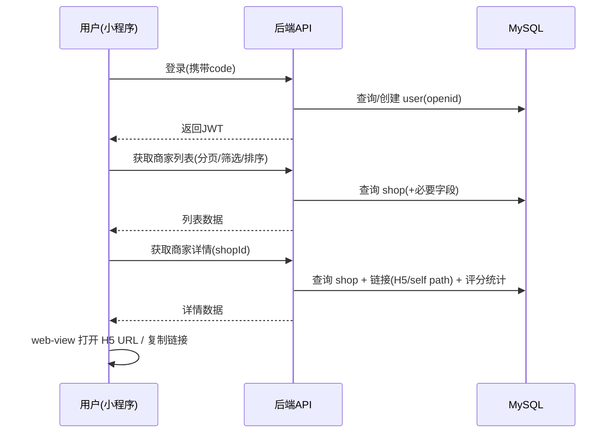

# 外卖聚合模块 — 概要设计

**范围**：仅外卖聚合模块（一期不含二手交易、不含“用户申请添加商家”）。  
**目标**：把《需求说明书》落到可实现的整体方案（模块边界、数据流、关键技术策略与约束）。

---

## 1. 总体架构

### 1.1 逻辑架构（端 → 服务 → 中间件）

```mermaid
flowchart LR
  MP[微信小程序(原生)] -->|HTTPS/JSON + JWT| API[后端 API(SB 3.2.x)]
  ADMIN[后台管理端(Vue3+AntD)] -->|HTTPS/JSON + JWT| API

  API --> DB[(MySQL 8.x)]
  API --> REDIS[(Redis 7.x)]
  API --> MQ[(RabbitMQ 3.x)]
  API --> OSS[(阿里云 OSS/CDN)]
```

### 1.2 关键技术选型（已确认）

- **后端**：JDK 21 + Spring Boot 3.2.x + Spring Security + JWT
- **持久层**：MyBatis + MyBatis-Plus（复杂 SQL 允许 `mapper.xml`）
- **存储**：MySQL 8.x（主库）、OSS（图片等静态资源）
- **缓存**：Redis 7.x（每日推荐结果缓存等）
- **MQ**：RabbitMQ 3.x（一期仅基础接入，业务异步化可后续逐步引入）
- **前端**：后台 Vue3+Vite+Ant Design Vue；小程序微信原生

---

## 2. 模块划分与职责边界

### 2.1 后端领域模块（建议按包/模块划分）

- **Auth（鉴权与用户）**
  - 小程序登录：`wx.login` 换取 openid，签发 JWT
  - 管理员登录：账号密码登录，签发 JWT
  - 鉴权拦截、权限校验、统一错误码

- **Shop（商家）**
  - 商家基础信息 CRUD、上下架、逻辑删除
  - 商家多平台链接配置（一期：平台只存 H5 URL；自营存 path）

- **Category（分类）**
  - 一级分类 CRUD、排序、启用/禁用
  - **规则**：分类被商家引用时禁止删除，只能禁用；删除必须先迁移商家

- **Recommend（每日推荐）**
  - 手动推荐：后台选店铺列表
  - 随机推荐：按自然日随机抽取 N（默认 4，可配置 3～10）
  - Redis 缓存：按日期缓存“当日推荐结果”

- **Rating（评分）**
  - 1～5 整星；一用户一商家一条评分，重复评分为“更新”
  - 商家维度维护：平均分、评分人数
  - **规则**：更新评分时评分人数不变

- **Favorite（收藏）**
  - 收藏/取消收藏、我的收藏列表
  - **规则**：商家下架后收藏记录保留并标注“已下架”，仍可进详情但隐藏/禁用下单跳转按钮

- **OperationLog（操作日志）**
  - 记录商家/分类/推荐等关键操作（不记录管理员登录/登出）
  - 一期可同步写库；后续可用 MQ 异步化

---

## 3. 核心业务流程（数据流）

### 3.1 小程序：浏览 → 详情 → 跳转（H5）



### 3.2 小程序：收藏（含下架后的展示）

- 收藏：写入 `shop_favorite`
- 我的收藏：按收藏时间倒序查询收藏列表 + 关联商家信息（标注已下架）
- 下架商家：详情页隐藏/禁用“去 XX 下单”按钮

### 3.3 小程序：评分（新增 vs 更新）

- 新增评分：写入 `shop_rating`，`shop.rating_count + 1`，按公式更新 `shop.avg_score`
- 更新评分：更新 `shop_rating`，`shop.rating_count` 不变，按公式修正 `shop.avg_score`

---

## 4. 数据模型概览（表级别）

> 详细字段见 `docs/数据库设计.md`，此处仅列核心表与关系。

- `user`：小程序用户（openid 唯一）
- `admin_user`：后台管理员
- `shop_category`：一级分类（可禁用）
- `shop`：商家主表（含评分统计字段 `avg_score`、`rating_count`）
- `shop_platform_link`：商家链接（一期：H5 URL；自营 path）
- `shop_rating`：评分（一用户一商家唯一）
- `shop_favorite`：收藏（一用户一商家唯一）
- `daily_recommend_config`：每日推荐配置（按自然日）
- `operation_log`：操作日志

---

## 5. 关键接口边界（概要级）

> 详细接口清单与字段在“详细设计/API 设计”阶段输出。

- **Auth**
  - 小程序登录：换取/创建用户、签发 JWT
  - 管理员登录：签发 JWT

- **Shop**
  - 列表：分页、平台/分类筛选、排序（权重/更新时间）、名称模糊搜索
  - 详情：基本信息 + 平台链接 + 评分统计 +（可选）是否已收藏

- **Favorite**
  - 收藏/取消收藏
  - 我的收藏列表（倒序）

- **Rating**
  - 评分新增/更新

- **Recommend**
  - 获取当日推荐（优先手动，否则随机；结果按日固定）

- **Admin（后台管理）**
  - 商家 CRUD、上下架、逻辑删除
  - 分类 CRUD、禁用（引用时禁止删除）
  - 推荐配置（手动/随机）
  - 评分统计查看

---

## 6. 非功能与约束（概要级）

- **鉴权**
  - 小程序端：进入外卖模块即需登录（JWT）
  - 后台端：管理员登录后访问管理接口

- **第三方跳转限制**
  - 美团/饿了么/京东/其他：仅 H5 URL，通过 `web-view` 打开；必要时支持复制链接

- **性能**
  - 列表分页：每页 10；接口 P95 ≤ 1s（按需求说明书）
  - 图片建议走 OSS+CDN

- **数据一致性**
  - 收藏、评分：一用户一商家唯一；重复操作需幂等（收藏重复点击不报错）

- **日志审计**
  - 记录商家/分类/推荐等关键操作；不记录管理员登录/登出

---

## 7. 后续阶段建议（从概要到落地）

1. **详细设计 / API 设计**：补齐接口 URL、入参出参、错误码、权限、分页排序规则（建议输出 `docs/API接口设计.md`）
2. **任务拆分与排期**：按模块拆后端/后台/小程序任务与验收点
3. **开发与联调**：先打通主链路（登录→列表→详情→跳转→收藏→评分→推荐）
